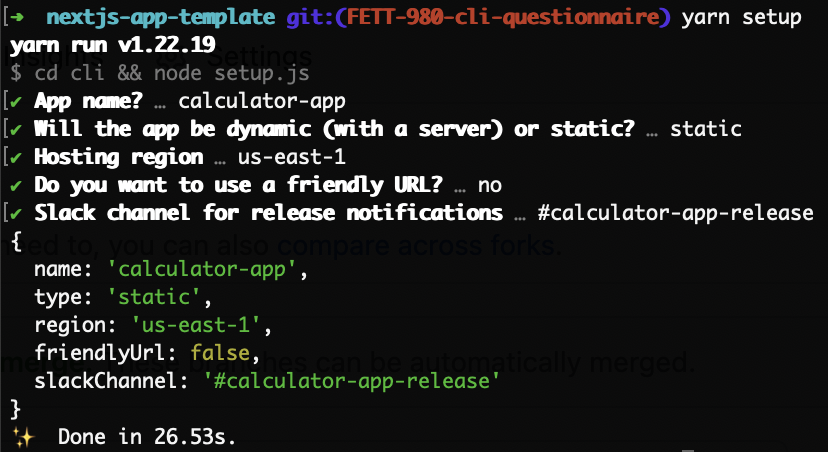

# Quotes Proof of Concept

## Getting Started

### Install

Clone this repo and run the command:

```bash
yarn install
```

### Run Initial Setup

Ensure that you have the `jq` binary installed on your Mac. Run the following to install it:

```bash
brew install jq
```

Then run the following command, which will ask a set of questions.

```bash
yarn setup
```



Your answers will be used to update the following configuration files, depending on your deployment type (static or dynamic). Original templates will then be removed from the repo.

- Github action workflows
- Terraform
- BNW ci/cd pipeline specs
- Dockerfile
- `package.json`

## TODO: Additional manual configuration

- TBD

### Run in Development mode

Run the following command to start a development server with hot reloading:

```bash
yarn dev
```

Open [http://localhost:3000](http://localhost:3000) with your browser to see the result.

Edit pages by modifying files in `src/pages/`. Each page automatically updates as you change and save a file.

### CODEOWNERS

Make sure to update `.github/CODEOWNERS` to accurately reflect the ownership of your app

### Maintainers

This template repository is managed by the Frontend Tooling Team
